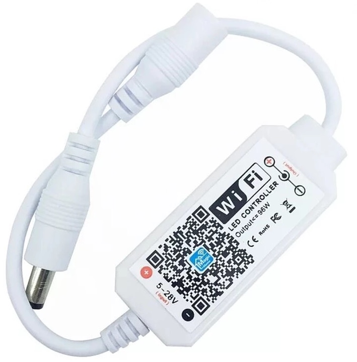

# Homebridge-MagicHome-Accessory

This plugin allows MagicHome single channel devices to be switched on/off and to be dimmed in HomeKit.

## Config

```json
"accessories": [
    {
      "accessory": "MagicHomeAccessory",
      "name": "LED Strip",
      "ip": "<The local IP address>",
      "port": 5577,
      "connect_timeout": 1000,
      "response_timeout": 500,
      "command_timeout": 100,
      "enabled_characteristics": [
        "On",
        "Brightness"
      ],
    },
],
```

### Properties

| Property                   | Description                                                                               | Default Value            |
| -------------------------- | ----------------------------------------------------------------------------------------- | ------------------------ |
| accessory *                | The plugins's name.                                                                       | `"MagicHomeAccessory"`   |
| name *                     | The readable name of the acessory.                                                        | `"MagicHome"`            |
| ip *                       | The local IP address (eg.: `192.168.0.48`).                                               | _empty_                  |
| port *                     | The port. This is usually `5577`.                                                         | `5577`                   |
| connect_timeout            | The time in `ms` after which the connection is beeing aborted without data sent/received. | `1000`                   |
| response_timeout           | The time in `ms` to wait for a response from the device.                                  | `500`                    |
| command_timeout            | The time in `ms` until a command is invalid.                                              | `100`                    |
| eneabled_characteristics * | Array of enabled characteristics for the device. (`"On"`\|`"Brightness"`)                 | [`"On"`, `"Brightness"`] |

 `*` Required fields

## Supported Devices

At this time only single channel/color controllers are supported like this one:



For RGB controllers I recommend using [homebridge-magichome2](https://www.npmjs.com/package/homebridge-magichome2).
